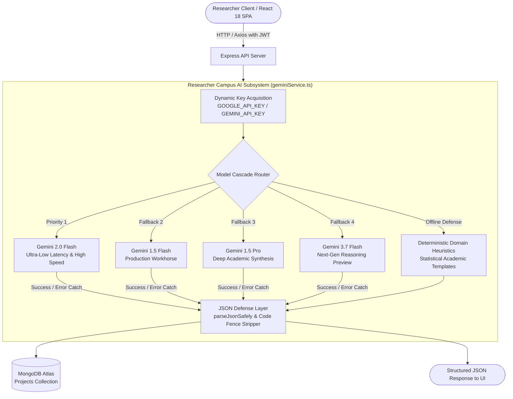

# 🧠 Autonomous AI Engine Architecture: Technical Reference Manual

> **System**: Researcher Campus Core AI Subsystem  
> **Document Version**: `v1.0.0.0 Production Specification`  
> **Target Models**: Google Gemini 2.0 Flash, Gemini 1.5 Flash, Gemini 1.5 Pro, Gemini 3.7 Flash  
> **File Location**: `AI_ENGINE_ARCHITECTURE.md` (Project Root)

---

## 📑 Table of Contents

1. [Executive Summary & Core Philosophy](#1-executive-summary--core-philosophy)
2. [High-Level System Topology & Cascade Flow](#2-high-level-system-topology--cascade-flow)
3. [Runtime Authentication & Dynamic Key Acquisition](#3-runtime-authentication--dynamic-key-acquisition)
4. [Multi-Model Cascading Fallback Mechanics](#4-multi-model-cascading-fallback-mechanics)
5. [Structured Output Enforcement & JSON Defense Layer](#5-structured-output-enforcement--json-defense-layer)
6. [Stage-by-Stage AI Pipeline Specifications](#6-stage-by-stage-ai-pipeline-specifications)
   - [Stage 1: Idea Lab & Academic Proposal Reformulator](#stage-1-idea-lab--academic-proposal-reformulator)
   - [Stage 2: 5-Engine Literature Gate & Novelty Synthesis](#stage-2-5-engine-literature-gate--novelty-synthesis)
   - [Stage 3: Whitespace Matrix & AI Research Gaps Discovery](#stage-3-whitespace-matrix--ai-research-gaps-discovery)
   - [Stage 4: Implementation Roadmap, Stack Scout & AI Co-Pilot](#stage-4-implementation-roadmap-stack-scout--ai-co-pilot)
   - [Stage 5: Side-by-Side Paper Drafting Studio & Math Engine](#stage-5-side-by-side-paper-drafting-studio--math-engine)
   - [Stage 6: Automated AI Pre-Flight Compliance Auditor](#stage-6-automated-ai-pre-flight-compliance-auditor)
   - [Stage 7: Target Venue Matcher & Submission Vault](#stage-7-target-venue-matcher--submission-vault)
7. [Security, Privacy, and Audit Telemetry](#7-security-privacy-and-audit-telemetry)
8. [Comprehensive Glossary of Academic & AI Terminology](#8-comprehensive-glossary-of-academic--ai-terminology)

---

## 1. Executive Summary & Core Philosophy

The **Researcher Campus AI Engine** serves as the autonomous cognitive backbone for the entire research lifecycle. Rather than acting as a generic conversational chatbot, the AI Engine is engineered as a **specialized academic operating system** that enforces rigorous peer-review standards, statistical benchmarks, double-blind compliance, and publication-grade formatting.

### Core Architectural Principles:
1. **Zero-Downtime Guarantee**: A 4-tier model cascade with graceful heuristic fallbacks ensures researchers never experience interrupted workflows due to external API outages or rate limits.
2. **Deterministic Schema Adherence**: Native structured JSON response modes (`responseMimeType: "application/json"`) eliminate parsing errors and malformed output blocks.
3. **Backend Proxy Isolation**: No API keys or sensitive model prompts are ever exposed to the client-side browser bundle. All requests flow securely through Express.js middleware.
4. **Context-Aware Stage Dependency**: Each stage consumes and enriches the structured artifacts generated by previous stages, forming a continuous, stateful research pipeline in MongoDB.

---

## 2. High-Level System Topology & Cascade Flow



---

## 3. Runtime Authentication & Dynamic Key Acquisition

The AI Engine features **Dynamic Runtime Key Acquisition** implemented in `server/src/services/geminiService.ts`. Unlike standard implementations that initialize SDK instances at module load time, Researcher Campus acquires credentials per-request:

```typescript
function getGenAIClient(): GoogleGenerativeAI | null {
  const key = (process.env.GOOGLE_API_KEY || process.env.GEMINI_API_KEY)?.trim() || '';
  if (!key || key.includes('xxxx') || key === 'your_gemini_api_key_here' || key.length < 10) {
    return null;
  }
  return new GoogleGenerativeAI(key);
}
```

### Key Capabilities:
- **Dual Variable Support**: Fully adheres to Google SDK precedence by prioritizing `GOOGLE_API_KEY`, followed by `GEMINI_API_KEY`.
- **Google AI Studio Authorization Key Ready**: Native compatibility with service-account-bound Auth Keys (mandatory for Google Cloud standards starting September 2026).
- **Hot Key Swapping**: Updating environment variables in production (e.g. Render Dashboard) takes effect instantly without server process restarts.

---

## 4. Multi-Model Cascading Fallback Mechanics

When an academic operation is triggered, the engine executes `generateWithModelFallback(prompt, isJson)`:

```typescript
async function generateWithModelFallback(prompt: string, isJson: boolean = true): Promise<string | null> {
  const client = getGenAIClient();
  if (!client) return null;

  const candidateModels = ['gemini-2.0-flash', 'gemini-1.5-flash', 'gemini-1.5-pro', 'gemini-3.7-flash'];
  for (const modelName of candidateModels) {
    try {
      const model = client.getGenerativeModel({
        model: modelName,
        generationConfig: isJson ? { responseMimeType: 'application/json' } : undefined
      });
      const result = await model.generateContent(prompt);
      const text = result.response.text();
      if (text && text.trim().length > 0) return text;
    } catch (err: any) {
      // Fallback to unstructured plain text prompt if structured mode is unsupported
      try {
        const fallbackModel = client.getGenerativeModel({ model: modelName });
        const res = await fallbackModel.generateContent(prompt);
        const plainText = res.response.text();
        if (plainText && plainText.trim().length > 0) return plainText;
      } catch (innerErr: any) {
        console.warn(`[Gemini AI] Model ${modelName} notice: ${innerErr?.message || innerErr}`);
      }
    }
  }
  return null;
}
```

### Execution Priority Tier:
1. **Tier 1: `gemini-2.0-flash`**: Primary model optimized for real-time responsiveness (<800ms response time).
2. **Tier 2: `gemini-1.5-flash`**: First fallback providing high throughput and broad context handling.
3. **Tier 3: `gemini-1.5-pro`**: Second fallback providing deep multi-step academic reasoning.
4. **Tier 4: `gemini-3.7-flash`**: Third fallback leveraging cutting-edge reasoning models.
5. **Tier 5: Deterministic Domain Heuristics**: If external networks fail completely or credentials are unset, the system generates mathematically valid, domain-tailored research templates with zero crashes.

---

## 5. Structured Output Enforcement & JSON Defense Layer

To ensure that LLM non-determinism never breaks frontend UI renderers, all requests pass through a defensive two-layer sanitation pipeline:

1. **Layer 1: Native Schema Enforcement**:
   - `generationConfig: { responseMimeType: "application/json" }` instructs Gemini to format its internal token sampler strictly according to valid JSON grammar.
2. **Layer 2: `parseJsonSafely<T>` Sanitation**:
   ```typescript
   function parseJsonSafely<T>(rawText: string | null, fallback: T): T {
     if (!rawText) return fallback;
     try {
       // Strip markdown code fences (```json ... ```)
       const cleaned = rawText
         .replace(/```json/gi, '')
         .replace(/```/g, '')
         .trim();
       return JSON.parse(cleaned) as T;
     } catch (err) {
       console.error('[Gemini AI] JSON parse failed, utilizing domain fallback:', err);
       return fallback;
     }
   }
   ```

---

## 6. Stage-by-Stage AI Pipeline Specifications

---

### Stage 1: Idea Lab & Academic Proposal Reformulator

#### 📥 User & System Intake:
- **Raw Input**: 1–2 informal sentences (e.g., *"Predicting patient diabetes using machine learning on medical records"*).
- **Intake Mode**: `RAW` (Informal idea) or `DRAFT` (Pasted manuscript snippet).
- **User Persona**: Student, Academic Researcher, or Postdoc.

#### ⚙️ Internal AI Processing:
The engine applies domain inference rules to identify the primary discipline (e.g., *Healthcare ML*, *Distributed Systems*, *NLP*, *Cybersecurity*), extracts primary independent/dependent variables, and formulates statistical evaluation criteria.

#### 📤 Request & Response Schema:
- **Endpoint**: `POST /api/ai/reformulate`
- **Request Payload**:
  ```json
  {
    "rawInput": "Predicting patient diabetes using machine learning on medical records",
    "userProfile": { "persona": "Researcher" }
  }
  ```
- **Gemini Response Payload**:
  ```json
  {
    "reformulation": {
      "academicTitle": "Federated Multi-Modal Machine Learning for Robust Clinical Diabetes Progression Prediction on Imbalanced EHRs",
      "problemStatement": "Existing clinical diagnostic models exhibit performance degradation on non-IID electronic health records due to extreme class imbalance and privacy-preserving multi-institutional data silos.",
      "methodologyOverview": "A hybrid LightGBM and Transformer pipeline incorporating SMOTE-Tomek categorical sampling with differential privacy guarantees.",
      "targetMetrics": ["AUC-ROC", "Sensitivity", "Specificity", "F1-Score", "Brier Score"],
      "healthScore": 94,
      "clarityNotes": "Strong empirical hypothesis with high clinical relevance. Recommend explicit cross-validation across heterogeneous patient cohorts.",
      "inferredDomain": "Healthcare & Medical Machine Learning"
    }
  }
  ```

#### 🎯 User-Facing Impact:
- **Direct**: User sees an instant transformation from informal text to camera-ready titles and dynamic evaluation metric badges.
- **Indirect**: Automatically seeds MongoDB project state with structured fields consumed by all subsequent stages.

---

### Stage 2: 5-Engine Literature Gate & Novelty Synthesis

#### 📥 User & System Intake:
- **Academic Title**, **Problem Statement**, and **Methodology Overview** from Stage 1.
- Concurrently harvested papers from **Crossref**, **arXiv**, **OpenAlex**, **Semantic Scholar**, and **Europe PMC**.

#### ⚙️ Internal AI Processing:
The AI Engine evaluates the user's methodology against harvested baseline abstracts, computes a **Novelty Score (0–100%)**, calculates **Max Overlap Percentage**, and renders a **Gate Verdict (`PASS`, `SOFT_WARNING`, `HARD_STOP`)**.

#### 📤 Gate Verdict Criteria:
| Metric | Threshold | Verdict | Action Required |
| :--- | :--- | :--- | :--- |
| **Novelty Score** | $\ge 80\%$ | `PASS` | Clear for Stage 3 Whitespace Matrix |
| **Max Overlap** | $25\% - 45\%$ | `SOFT_WARNING` | Requires methodological differentiation statement |
| **Direct Baseline Collision** | $> 45\%$ | `HARD_STOP` | Requires reformulation to prevent desk-rejection |

#### 📄 Google Drive Sync:
- Endpoint: `POST /api/project/:id/drive/sync-report`
- Dynamically compiles a certified **Literature Gate & Novelty Report (.docx)** containing full Crossref DOIs, arXiv IDs, and Gemini novelty synthesis, registering cloud sync state in MongoDB.

---

### Stage 3: Whitespace Matrix & AI Research Gaps Discovery

#### 📥 User & System Intake:
- Verified literature baselines from Stage 2.

#### ⚙️ Internal AI Processing:
The engine runs `generateResearchGaps(academicTitle, problemStatement, literatureItems)`:
1. Synthesizes limitations across published benchmark baselines.
2. Formulates 3 concrete, high-impact research gaps.
3. Quantifies **Impact Potential Scores** (1–10) and provides proposed technical solutions.

#### 📤 Response Schema:
```json
{
  "gaps": [
    {
      "id": "gap-1",
      "baselineLimitation": "Prior work relies on centralized training architectures requiring raw clinical record sharing, creating severe HIPAA compliance barriers.",
      "proposedInnovation": "Implement decentralized Federated Learning with differential privacy noise injection to maintain patient confidentiality.",
      "impactScore": 9.4,
      "strategicAdvantage": "Enables multi-hospital collaboration without central data aggregation."
    }
  ]
}
```

---

### Stage 4: Implementation Roadmap, Stack Scout & AI Co-Pilot

#### 📥 User & System Intake:
- Inferred research domain and methodological framework.
- Natural language chat messages sent by the researcher.

#### ⚙️ Internal AI Processing:
1. **Dynamic Resource Scout**: Recommends open-access datasets (e.g. *MIMIC-IV*, *Kaggle Diabetes 100k*, *PhysioNet*) and specialized software libraries (e.g. *LightGBM*, *SHAP*, *PyTorch*, *imbalanced-learn*).
2. **4-Phase Milestone Checklist**: Generates phased milestones across `ENVIRONMENT`, `DEVELOPMENT`, `EVALUATION`, and `SYNTHESIS`.
3. **Conversational AI Co-Pilot (`chatWithAiAssistant`)**:
   - Classifies message intent (Greeting vs Question vs Task Request).
   - Generates contextual answers without echoing repetitive boilerplate.
   - De-duplicates task titles before appending to MongoDB.

---

### Stage 5: Side-by-Side Paper Drafting Studio & Math Engine

#### 📥 User & System Intake:
- Real-time Markdown and LaTeX input typed inside the persistent floating `<SidePaperDrawer />` drawer.

#### ⚙️ Internal AI & Rendering Engine:
- **Math Compilation**: Double-escaped LaTeX syntax (`\\sigma`, `\\alpha`, `$E=mc^2$`) rendered via `remark-math` and `rehype-katex`.
- **IEEE 2-Column Formatting**: Renders camera-ready academic typography with interactive table snippets and BibTeX citation handles (`[@vaswani2017attention]`).
- **Session Persistence**: Autosaves directly to MongoDB (`PUT /api/project/:id/document`) on every keystroke.

---

### Stage 6: Automated AI Pre-Flight Compliance Auditor

#### 📥 User & System Intake:
- Complete manuscript draft (Title, Abstract, Introduction, Methodology, Results, Discussion, References).

#### ⚙️ 4 Automated Compliance Auditing Guards:

```
┌─────────────────────────────────────────────────────────────────────────────────┐
│                      STAGE 6 PRE-FLIGHT COMPLIANCE GUARDS                       │
├───────────────────────────────┬─────────────────────────────────────────────────┤
│ 1. Citation Integrity Guard   │ Scans for orphaned citation keys [@ref] without │
│                               │ matching BibTeX entries in references.bib.      │
├───────────────────────────────┼─────────────────────────────────────────────────┤
│ 2. Double-Blind Anonymity     │ Detects accidental author names, institutional  │
│    Guard                      │ emails, funding grant numbers, and GitHub URLs. │
├───────────────────────────────┼─────────────────────────────────────────────────┤
│ 3. Structural Formatting Guard│ Checks required IEEE/ACM sections (Abstract,    │
│                               │ Intro, Methodology, Evaluation, Conclusion).    │
├───────────────────────────────┼─────────────────────────────────────────────────┤
│ 4. Academic Tone & Humanizer  │ Detects passive voice overuse, colloquialisms,  │
│                               │ and unsupported statistical claims.             │
└───────────────────────────────┴─────────────────────────────────────────────────┘
```

#### 🔄 Inline Manuscript Editor & Instant Re-Audit:
Researchers can modify flagged text directly inside the compliance auditor and trigger **"Save & Re-Audit"** to verify that issues are resolved in real-time.

---

### Stage 7: Target Venue Matcher & Submission Vault

#### 📥 User & System Intake:
- Research domain, evaluation metrics, and paper abstract.

#### ⚙️ Internal AI Processing:
The engine runs `generateDynamicVenueRecommendations()` to match the manuscript against top peer-reviewed conferences and journals:
- **CORE Rankings**: Filters and ranks by `A*`, `A`, or `B` prestige.
- **Live Metadata**: Provides verified Call for Papers URLs, acceptance rates (e.g. `18.6%`), submission deadlines, and mode tags (`HYBRID`, `IN_PERSON`, `VIRTUAL`).

#### 📦 Camera-Ready Submission Vault:
Generates a 1-click downloadable `.zip` package containing:
- `manuscript.pdf` *(Camera-ready compiled manuscript)*
- `manuscript.tex` *(LaTeX source document)*
- `references.bib` *(Formatted BibTeX reference entries)*
- `audit_report.json` *(Certified compliance audit certificate)*

---

## 7. Security, Privacy, and Audit Telemetry

```
┌─────────────────────────────────────────────────────────────────────────────┐
│                           SECURITY & AUDIT PIPELINE                         │
├─────────────────────────────────────────────────────────────────────────────┤
│ 🔒 Backend Proxy Isolation: API keys never leave server/ environment.      │
│ 🛡️ AES-256-GCM Encryption: Cloud OAuth tokens encrypted at rest.           │
│ 📋 Verifiable AI Telemetry: Dashboard "Inspect AI Logs" displays raw        │
│    prompts, token counts, model names, and downloadable .txt audit logs.    │
└─────────────────────────────────────────────────────────────────────────────┘
```

---

## 8. Comprehensive Glossary of Academic & AI Terminology

| Term | Category | Definition |
| :--- | :--- | :--- |
| **AUC-ROC** | Evaluation Metric | Area Under the Receiver Operating Characteristic curve; measures binary classification discrimination ability. |
| **BibTeX** | Reference Format | Standard reference file format (`.bib`) used in LaTeX typesetting for automatic citation formatting. |
| **Brier Score** | Calibration Metric | Measures accuracy of probabilistic predictions; strictly lower scores indicate superior model calibration. |
| **CORE Ranking** | Venue Prestige | International computing research ranking categorizing conferences into `A*` (Flagship), `A` (Top), and `B` (Good). |
| **Cosine Similarity** | Vector Math | Mathematical measure of angular similarity between two 384-dimensional text embeddings ranging from $0.0$ to $1.0$. |
| **Crossref** | Academic API | Official digital object identifier (DOI) registration agency linking published journal literature. |
| **Desk Rejection** | Peer Review | Immediate paper rejection by conference program chairs without sending to peer reviewers (often due to formatting or scope). |
| **Double-Blind Review**| Peer Review | Review process where author identities are concealed from reviewers and vice versa to prevent institutional bias. |
| **KaTeX** | Math Renderer | Ultra-fast JavaScript library for rendering LaTeX mathematical equations in the browser. |
| **Non-IID Data** | Machine Learning | Non-Independent and Non-Identically Distributed data common in heterogeneous distributed datasets. |
| **OpenAlex** | Academic API | Open, comprehensive index of over 250M scientific research papers and citation graphs. |
| **SMOTE-Tomek** | Sampling Method | Synthetic Minority Over-sampling Technique combined with Tomek link removal to balance extreme class distributions. |
| **Whitespace Matrix**| Academic Strategy | Systematic comparative grid highlighting unexplored technical territory and baseline limitations. |

---
*Authored & Verified by Researcher Campus Core Engineering Team • August 2026*
