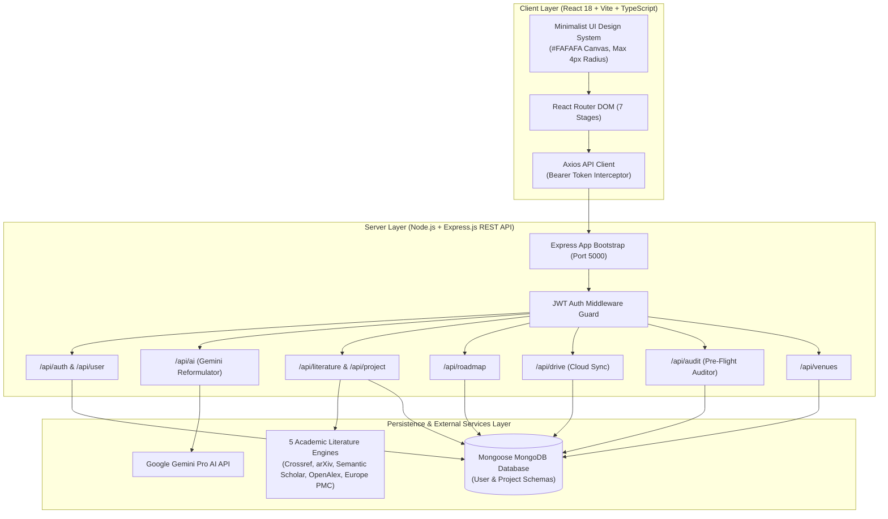
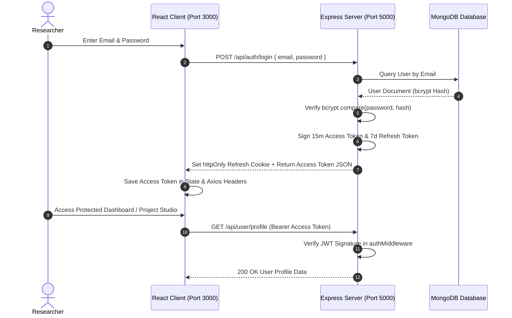
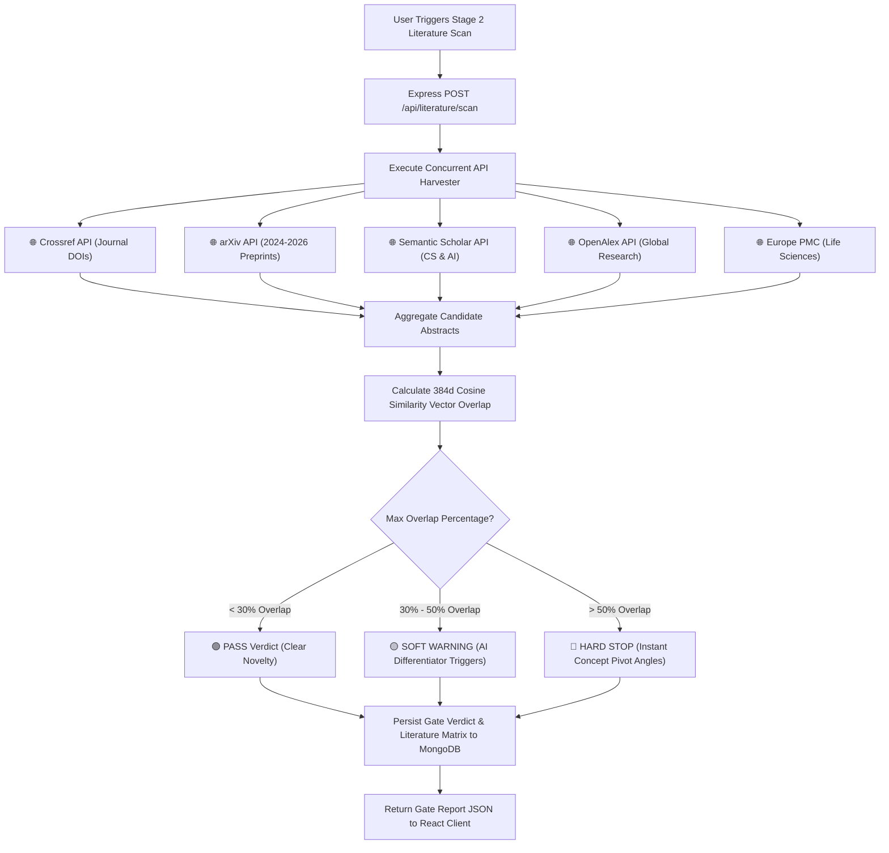
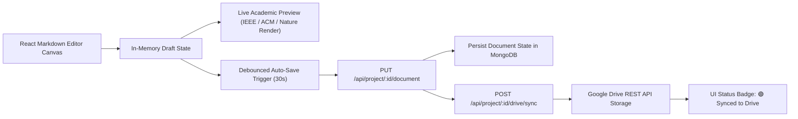

# 🏗️ Researcher Campus Technical Architecture & Design Document

This document details the software architecture, data flow sequences, security models, and internal algorithms powering the **Researcher Campus Autonomous AI Academic Operating System**.

---

## 📐 1. System Topology & Monorepo Architecture

Researcher Campus is engineered on a **Classic MERN Stack Monorepo Architecture** (`client/` React 18 + Vite + TypeScript & `server/` Node.js + Express.js + Mongoose MongoDB), ensuring zero framework lock-in and high scalability.

---

## 🔐 2. Security & Dual-Token Authentication Flow

Authentication utilizes a **Dual-Token JWT Architecture** paired with `bcrypt` password hashing and `httpOnly` cookie protection:
- **Access Token (15 Minutes)**: In-memory short-lived token sent via `Authorization: Bearer <token>` HTTP header.
- **Refresh Token (7 Days)**: Stored in an `httpOnly`, `SameSite=Strict`, `Secure` browser cookie to eliminate XSS token theft risks.
- **Google Drive Credentials**: Encrypted at rest using AES-256-GCM authenticated encryption (`crypto.ts`).

---

## 🌐 3. 5-Engine Literature Scan & Cosine Similarity Gate Algorithm

When a researcher initiates Stage 2 Literature Verification, the server executes parallel requests across 5 global academic databases and calculates a **384-Dimensional Cosine Similarity Overlap**:

---

## 📑 4. Document Drafting & Google Drive Auto-Sync Pipeline

In Stage 5 (Paper Studio), manuscript state is updated in real time with automatic cloud synchronization:

