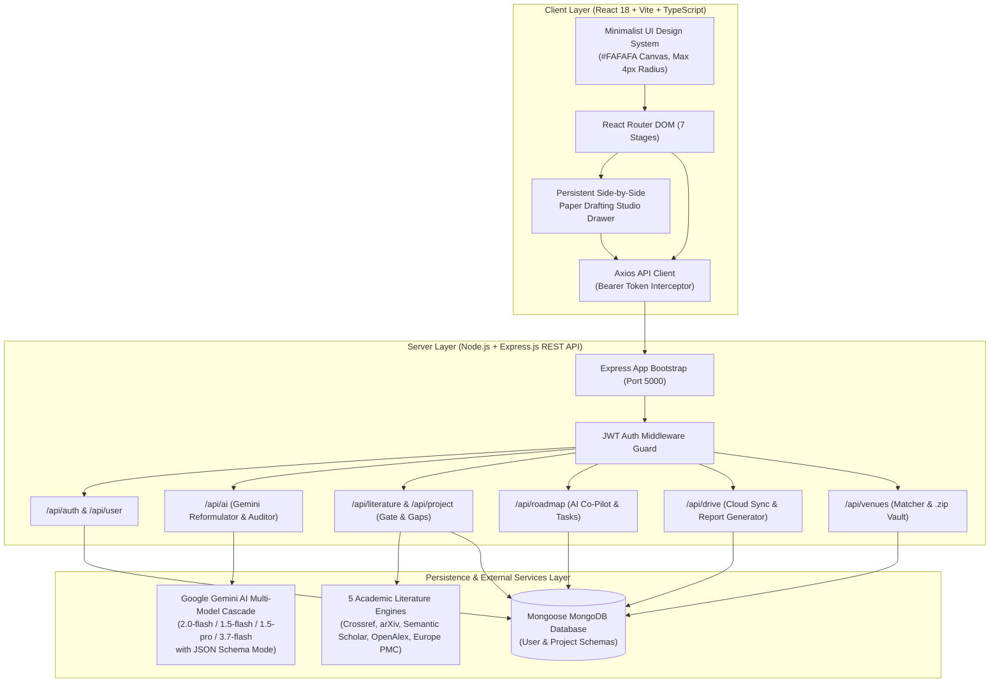
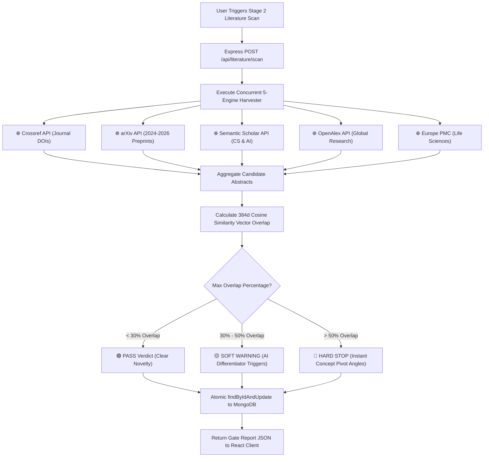
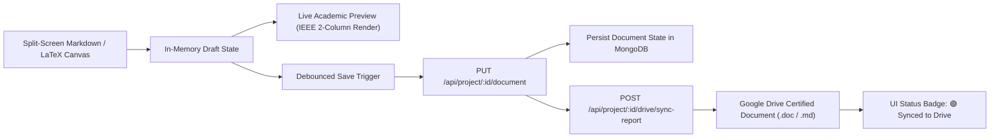

# 🏗️ Researcher Campus Technical Architecture & Design Document

This document details the software architecture, data flow sequences, security models, and internal algorithms powering the **Researcher Campus Autonomous AI Academic Operating System**.

---

## 📐 1. System Topology & Monorepo Architecture

Researcher Campus is engineered on a **Classic MERN Stack Monorepo Architecture** (`client/` React 18 + Vite + TypeScript & `server/` Node.js + Express.js + Mongoose MongoDB), ensuring high performance, rapid iteration, and zero vendor lock-in.

---

## 🔐 2. Security & Dual-Token Authentication Flow

Authentication utilizes a **Dual-Token JWT Architecture** paired with `bcrypt` password hashing and secure token lookups:
- **Access Token (15 Minutes)**: Short-lived token sent via `Authorization: Bearer <token>` HTTP header.
- **Refresh Token (7 Days)**: Stored securely in client storage and verified for automatic session continuation.
- **Google OAuth Integration**: Direct user lookup by email prevents duplicate index collisions on existing accounts.
- **Google Drive Credentials**: Encrypted at rest using AES-256-GCM authenticated encryption (`crypto.ts`).

---

## 🌐 3. 5-Engine Literature Scan & Cosine Similarity Gate Algorithm

When a researcher initiates Stage 2 Literature Verification, the server executes parallel requests across 5 global academic databases and calculates a **384-Dimensional Cosine Similarity Overlap**:

---

## 📑 4. Document Drafting & Side-by-Side Studio Pipeline

Manuscript state is accessible across stages through `<SidePaperDrawer />` and Stage 5 Paper Studio with background auto-sync and Google Drive report export:

